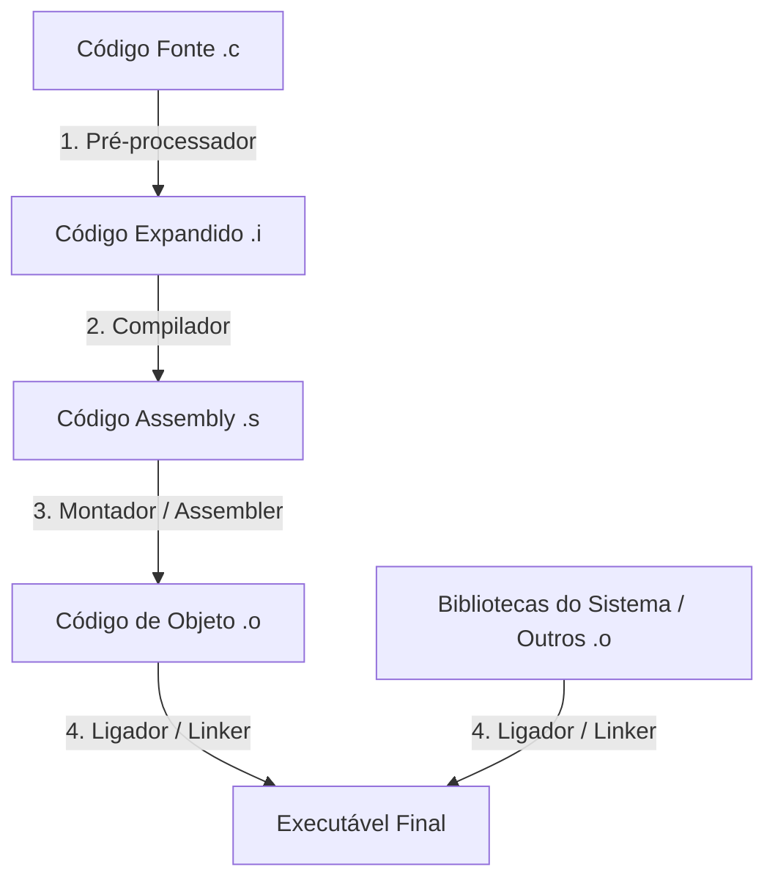

## 7. Compilação Separada e Bibliotecas Externas

Nos capítulos anteriores, vimos como estruturar dados complexos com [structs](cap05.md) e como gerenciar memória dinamicamente usando [ponteiros](cap06.md). Também arranhamos a superfície de dividir o código em múltiplos arquivos no [Capítulo 3](cap03.md). Agora, vamos entender a fundo o processo de **compilação separada** e como o C interage com **bibliotecas externas** do mundo real, comparando esses mecanismos com o que acontece em Python e em JavaScript.

!!! note "O processo por trás da mágica"
    Em Python ou JavaScript, quando você quer usar uma biblioteca, basta um comando (`pip install` ou `npm install`) e uma linha no código (`import` ou `require`). Em C, não existe um gerenciador de pacotes universal e embutido na linguagem. O C nos obriga a entender as etapas físicas que o código atravessa até virar um executável. Embora isso dê mais trabalho, nos dá um controle total sobre o consumo de memória e a performance do programa.

---

### 7.1. Como funciona o processo de compilação em C

Diferente de Python (que é interpretado linha a linha em tempo de execução) e de VisuAlg (que executa o pseudocódigo diretamente em seu próprio ambiente), o C traduz seus arquivos fonte para código de máquina antes de rodar. Esse processo não acontece de uma vez só; ele é dividido em quatro etapas distintas:



1. **Pré-processamento**: O pré-processador processa as diretivas que começam com `#` (como `#include` e `#define`). Ele essencialmente "copia e cola" o conteúdo dos arquivos de cabeçalho (`.h`) no topo do arquivo `.c` e substitui as macros. O resultado é um código C puro intermediário (geralmente oculto, com extensão `.i`).
2. **Compilação**: O compilador traduz o código C expandido para linguagem assembly específica da arquitetura do seu processador (gerando arquivos `.s`).
3. **Montagem (Assembly)**: O montador traduz o código assembly em código de máquina binário. O resultado é um **arquivo de objeto** (geralmente com extensão `.o` no Linux/macOS ou `.obj` no Windows). O arquivo de objeto contém o código binário das suas funções, mas ainda não sabe onde estão as funções de outros arquivos que ele chama (elas ficam marcadas como "endereços pendentes").
4. **Ligação (Linking)**: O ligador (*linker*) junta todos os arquivos de objeto (`.o`) do seu projeto com o código de máquina de bibliotecas pré-compiladas (como a biblioteca padrão do C, `libc`) para resolver todos os endereços pendentes e gerar o arquivo executável final.

!!! tip "Observando o processo com o GCC"
    Você pode pedir para o `gcc` manter todos os arquivos intermediários criados durante a compilação de um arquivo `main.c` com a tag `--save-temps`:
    ```bash
    gcc --save-temps main.c -o main
    ```
    Isso gerará no seu diretório os arquivos `main.i` (código pré-processado), `main.s` (código em assembly) e `main.o` (código de objeto), além do executável `main`.

---

### 7.2. Compilação separada na prática: exemplo da conta bancária

Para entender a compilação separada, vamos criar um sistema simples de **Conta Bancária** dividido em três arquivos:

1. `conta.h`: Contém a definição da estrutura de dados ([struct](cap05.md)) e os protótipos das funções (a "interface" da biblioteca).
2. `conta.c`: Contém a implementação real das funções da conta bancária (o "corpo" do código).
3. `main.c`: O programa principal que utiliza a conta bancária para realizar operações.

#### 1. O cabeçalho: `conta.h`

```c
#ifndef CONTA_H
#define CONTA_H

typedef struct {
    int numero;
    double saldo;
} ContaBancaria;

// Protótipos das funções
void inicializar(ContaBancaria *c, int numero, double saldo_inicial);
void depositar(ContaBancaria *c, double valor);
int sacar(ContaBancaria *c, double valor); // Retorna 1 se sucesso, 0 se saldo insuficiente
void exibir(const ContaBancaria *c);

#endif
```

!!! note "Guardas de Inclusão (#ifndef, #define, #endif)"
    As diretivas `#ifndef CONTA_H`, `#define CONTA_H` e `#endif` são chamadas de **guardas de inclusão** (header guards). Elas garantem que, mesmo que `conta.h` seja incluído múltiplas vezes no mesmo projeto (por exemplo, se `main.c` incluir `conta.h` e outra biblioteca também o fizer), o compilador não tentará ler e declarar a estrutura `ContaBancaria` duas vezes, o que geraria um erro de "redefinição de tipo".

#### 2. A implementação: `conta.c`

```c
#include <stdio.h>
#include "conta.h"

void inicializar(ContaBancaria *c, int numero, double saldo_inicial) {
    c->numero = numero;
    c->saldo = saldo_inicial;
}

void depositar(ContaBancaria *c, double valor) {
    if (valor > 0) {
        c->saldo += valor;
    }
}

int sacar(ContaBancaria *c, double valor) {
    if (valor > 0 && c->saldo >= valor) {
        c->saldo -= valor;
        return 1; // Sucesso
    }
    return 0; // Saldo insuficiente ou valor inválido
}

void exibir(const ContaBancaria *c) {
    printf("Conta: %d | Saldo: R$ %.2f\n", c->numero, c->saldo);
}
```

!!! note "O `const` antes do ponteiro"
    Repare no `const` antes de `ContaBancaria *c` no protótipo de `exibir`. Isso é uma promessa ao compilador: esta função só vai *ler* os campos de `c` através do ponteiro, nunca alterá-los. Se o corpo da função tentar fazer `c->saldo = 0;`, o compilador recusa a compilação. É uma forma de deixar explícito, só pela assinatura da função, que ela não modifica o struct original — parecido com o que fizemos na Seção 5.2 ao decidir entre receber um struct por valor ou por ponteiro, só que aqui pedimos o "melhor dos dois mundos": a eficiência de passar só um endereço, sem o risco de alterar o original.

#### 3. O programa principal: `main.c`

```c
#include <stdio.h>
#include "conta.h"

int main() {
    ContaBancaria minha_conta;
    
    // Inicialização (passando o endereço via ponteiro)
    inicializar(&minha_conta, 1234, 500.0);
    exibir(&minha_conta);
    
    depositar(&minha_conta, 150.0);
    exibir(&minha_conta);
    
    if (sacar(&minha_conta, 200.0)) {
        printf("Saque de R$ 200.00 realizado com sucesso!\n");
    } else {
        printf("Falha no saque: saldo insuficiente!\n");
    }
    exibir(&minha_conta);
    
    return 0;
}
```

#### Compilando e linkando passo a passo

Em vez de compilar tudo de uma vez com `gcc main.c conta.c -o programa`, podemos realizar a compilação separada. Isso é crucial para grandes projetos, pois se você alterar apenas o `main.c`, não precisa recompilar o `conta.c` inteiro novamente:

1. **Compilar `conta.c` em arquivo de objeto (`conta.o`)**:
   ```bash
   gcc -c conta.c -o conta.o
   ```
   *A tag `-c` diz ao compilador para parar após a etapa de montagem, ou seja, gerar o `.o` sem tentar rodar o linker.*

2. **Compilar `main.c` em arquivo de objeto (`main.o`)**:
   ```bash
   gcc -c main.c -o main.o
   ```

3. **Linkar os objetos para gerar o executável final**:
   ```bash
   gcc conta.o main.o -o programa
   ```
   *O linker junta `conta.o` e `main.o` e resolve as chamadas das funções (`inicializar`, `depositar`, etc.) que `main` usou.*

#### Automatizando com `make` e `Makefile`

Digitar esses comandos manualmente no terminal toda vez que alteramos o código é cansativo e sujeito a erros — principalmente quando o projeto cresce e passa a ter dezenas de arquivos `.c`.

Para automatizar isso, o mundo C utiliza uma ferramenta chamada **`make`**, que lê as instruções de um arquivo chamado **`Makefile`** (sem extensão). O `Makefile` define **regras** de compilação e as **dependências** de cada arquivo.

Aqui está um `Makefile` simples para o nosso projeto da Conta Bancária:

```makefile
# Makefile para o projeto Conta Bancaria

# Regra padrão: gera o executável 'programa'
# Depende de conta.o e main.o
programa: conta.o main.o
	gcc conta.o main.o -o programa

# Regra para gerar conta.o
# Depende de conta.c e conta.h
conta.o: conta.c conta.h
	gcc -c conta.c -o conta.o

# Regra para gerar main.o
# Depende de main.c e conta.h
main.o: main.c conta.h
	gcc -c main.c -o main.o

# Regra utilitária para limpar arquivos de compilação
clean:
	rm -f *.o programa
```

!!! warning "Atenção com a indentação no Makefile"
    No `Makefile`, a linha com o comando de compilação (ex: `gcc ...`) **deve** começar com um caractere de tabulação real (**Tab**), e não com espaços. O uso de espaços gera o clássico erro `Makefile:*** missing separator. Stop.`.

Agora, em vez de digitar os comandos um a um, você só precisa digitar no terminal:

```bash
make
```

O `make` é inteligente: ele compara a data de modificação dos arquivos fonte com a dos arquivos de objeto `.o`. Se você alterar apenas o `main.c` e rodar `make` novamente, ele sabe que `conta.o` ainda está atualizado e **recompila apenas o `main.c`** antes de linkar.

Para apagar os arquivos temporários criados, basta rodar:

```bash
make clean
```

Como o Python gerencia seu próprio cache de bytecode pré-compilado (os arquivos `.pyc` dentro da pasta `__pycache__`) de forma totalmente automática, desenvolvedores Python quase nunca precisam configurar ferramentas como o `make` para o ciclo básico de compilação.

---

### 7.3. Comparação com Python e VisuAlg

Vamos ver como o mesmo exemplo da conta bancária se comportaria nas linguagens de comparação.

#### VisuAlg

No VisuAlg, não existe modularização física em múltiplos arquivos. Todo o código do registro e suas sub-rotinas precisam estar contidos em um único arquivo `.alg`.

```
algoritmo "ContaBancaria"
tipo
    Conta = registro
        numero: inteiro
        saldo: real
    fimregistro

var
    minha_conta: Conta
    sucesso: logico

procedimento inicializar(var c: Conta; num: inteiro; sal: real)
inicio
    c.numero <- num
    c.saldo <- sal
fimprocedimento

procedimento depositar(var c: Conta; valor: real)
inicio
    se valor > 0 entao
        c.saldo <- c.saldo + valor
    fimse
fimprocedimento

funcao sacar(var c: Conta; valor: real): logico
inicio
    se (valor > 0) e (c.saldo >= valor) entao
        c.saldo <- c.saldo - valor
        retorne verdadeiro
    senao
        retorne falso
    fimse
fimfuncao

procedimento exibir(c: Conta)
inicio
    escreval("Conta: ", c.numero, " | Saldo: R$ ", c.saldo:0:2)
fimprocedimento

inicio
    inicializar(minha_conta, 1234, 500.0)
    exibir(minha_conta)
    
    depositar(minha_conta, 150.0)
    exibir(minha_conta)
    
    sucesso <- sacar(minha_conta, 200.0)
    se sucesso entao
        escreval("Saque de R$ 200.00 realizado com sucesso!")
    senao
        escreval("Falha no saque: saldo insuficiente!")
    fimse
    exibir(minha_conta)
fimalgoritmo
```

#### Python

Em Python, a modularização é natural e usa orientação a objetos. Criamos o arquivo `conta.py`:

```python
class ContaBancaria:
    def __init__(self, numero: int, saldo_inicial: float):
        self.numero = numero
        self.saldo = saldo_inicial

    def depositar(self, valor: float):
        if valor > 0:
            self.saldo += valor

    def sacar(self, valor: float) -> bool:
        if valor > 0 and self.saldo >= valor:
            self.saldo -= valor
            return True
        return False

    def exibir(self):
        print(f"Conta: {self.numero} | Saldo: R$ {self.saldo:.2f}")
```

E no arquivo `main.py`, nós importamos a classe:

```python
from conta import ContaBancaria

minha_conta = ContaBancaria(1234, 500.0)
minha_conta.exibir()

minha_conta.depositar(150.0)
minha_conta.exibir()

if minha_conta.sacar(200.0):
    print("Saque de R$ 200.00 realizado com sucesso!")
else:
    print("Falha no saque: saldo insuficiente!")
minha_conta.exibir()
```

#### Diferenças no ciclo de vida

| Característica | C | Python | VisuAlg |
|---|---|---|---|
| **Formato de entrega** | Executável compilado binário (`programa`) | Código fonte `.py` ou bytecode pré-compilado `.pyc` | Arquivo único de texto `.alg` |
| **Passo de Linkagem** | Manual ou gerido por Makefile/CMake | Automático e dinâmico em tempo de execução | Inexistente (tudo no mesmo arquivo) |
| **Detecção de Erros** | Erros de digitação de funções são pegos na compilação ou linkagem | Erros de digitação de funções só dão erro quando a linha é executada (*NameError*) | Pegos na verificação de sintaxe antes de rodar |

!!! question "Exercício de mapeamento 7.1"
    Se você alterar apenas o corpo da função `depositar` no arquivo `conta.c` para cobrar uma taxa de R$ 0.10 a cada depósito, quais arquivos precisam ser recompilados (usando a tag `-c`) e quais precisam ser linkados novamente para atualizar o executável final? Responda sem rodar os comandos.

---

### 7.4. Bibliotecas externas: C vs Python vs JavaScript

No desenvolvimento moderno, raramente escrevemos tudo do zero. Usamos bibliotecas criadas por terceiros. Vamos ver a diferença brutal de como cada ecossistema lida com isso.

#### Python (`pip`)
Em Python, instalamos bibliotecas a partir do repositório central PyPI usando o `pip`:
```bash
pip install requests
```
O pacote é baixado para a sua pasta de ambiente virtual (`.venv`) ou global do sistema. Ao rodar `import requests`, o interpretador Python sabe exatamente em qual diretório procurar a biblioteca instalada e a carrega dinamicamente. Você não precisa passar nenhuma configuração de compilação adicional ao rodar seu código.

#### JavaScript / Node.js (`npm`)
Em JavaScript/Node.js, instalamos via `npm`:
```bash
npm install axios
```
A biblioteca é baixada para a pasta `node_modules` local do projeto. Quando fazemos `import axios from 'axios'` ou `require('axios')`, o NodeJS resolve a dependência procurando recursivamente na pasta `node_modules`. Toda a resolução de caminho é abstraída pelo runtime.

#### C (compilação e linkagem manual com tags)
Em C, as coisas são mais primitivas e próximas do sistema operacional. Se quisermos usar uma biblioteca externa (como a biblioteca do PostgreSQL `libpq` ou o driver do MongoDB `libmongoc`), o processo costuma ser:

1. **Instalar os arquivos de desenvolvimento no sistema**:
   No Linux Debian/Ubuntu, isso é feito via gerenciador de pacotes do sistema (apt), instalando os pacotes `-dev` (que contêm os cabeçalhos `.h` e arquivos de linkagem):
   ```bash
   sudo apt-get install libpq-dev
   sudo apt-get install libmongoc-dev
   ```

2. **Dizer ao compilador onde achar os arquivos**:
   Para compilar o código C, precisamos dizer ao compilador:
   - **Onde estão os arquivos de cabeçalho (`.h`)**: usando a tag `-I` (Include). Por padrão, o GCC busca em `/usr/include`, mas se a biblioteca estiver em outro local, você precisa de `-I/caminho/para/headers`.
   - **Onde estão os arquivos binários da biblioteca (`.so` ou `.a`)**: usando a tag `-L` (Library path), por exemplo `-L/usr/lib`.
   - **Qual é o nome da biblioteca que queremos linkar**: usando a tag `-l` (link), por exemplo `-lpq` (para o PostgreSQL) ou `-lmongoc-1.0` (para o MongoDB).

Abaixo está o exemplo conceitual de como o compilador precisa receber essas tags:

```bash
gcc -I/usr/include/postgresql exemplopq.c -o programa -L/usr/lib/postgresql -lpq
```

#### O salvador: `pkg-config`

Decorar todos os caminhos de cabeçalhos e nomes de bibliotecas de terceiros no sistema é impraticável. Para resolver isso, usamos uma ferramenta utilitária chamada `pkg-config`. Ela consulta a instalação da biblioteca no sistema e imprime as tags corretas para o compilador:

- Para ver as tags de inclusão de cabeçalho (Cflags):
  ```bash
  pkg-config --cflags libpq
  # Saída típica: -I/usr/include/postgresql
  ```
- Para ver as tags de linkagem (Libs):
  ```bash
  pkg-config --libs libpq
  # Saída típica: -lpq
  ```

Podemos injetar a saída do `pkg-config` diretamente no comando do GCC usando crases (backticks) ou a sintaxe `$()` do terminal bash:

```bash
gcc $(pkg-config --cflags libpq) exemplopq.c -o programa $(pkg-config --libs libpq)
```

Isso torna o processo de compilação com bibliotecas externas muito mais portátil, já que o `pkg-config` descobrirá os caminhos corretos independentemente de o sistema ser Ubuntu, Fedora ou macOS.

---

### 7.5. Lista de exercícios

#### Conceituais
1. Explique, com suas palavras, qual a diferença entre um arquivo de cabeçalho (`.h`) e um arquivo de código fonte (`.c`). Por que não devemos escrever o corpo das funções dentro de um arquivo `.h`?
2. O que acontece na etapa de **Ligação (Linking)** no processo de compilação do C? Que tipo de erro o linker gera se você declarar um protótipo de função em um `.h`, incluí-lo no `main.c`, mas esquecer de compilar/linkar o arquivo `.c` correspondente que define a função?
3. Explique a diferença de como o Python e o C resolvem o acesso às funções de uma biblioteca externa instalada no sistema.
4. Por que usamos guardas de inclusão (`#ifndef`, `#define`, `#endif`) em arquivos `.h`? Dê um exemplo do problema que ocorreria se não os usássemos.

#### Programação
5. Crie um pequeno módulo de operações geométricas em C composto por:
   - `geometria.h`: Contém a constante `PI` (via `#define`) e os protótipos de `double calcular_area_circulo(double raio)` e `double calcular_perimetro_circulo(double raio)`.
   - `geometria.c`: A implementação das duas funções.
   - `main.c`: Lê o raio do usuário, chama as funções e imprime os resultados.
   Escreva no topo do arquivo `main.c`, como comentário, os comandos do GCC para compilar separadamente `geometria.c` e `main.c` em arquivos de objeto `.o`, e depois o comando para gerar o executável final `circulo`.
6. Considere o arquivo de cabeçalho abaixo (`calculadora.h`):
   ```c
   #ifndef CALCULADORA_H
   #define CALCULADORA_H

   int somar(int a, int b);
   int subtrair(int a, int b);
   int multiplicar(int a, int b);
   double dividir(int a, int b); // Retorna 0.0 se b for zero

   #endif
   ```
   Escreva o arquivo `calculadora.c` correspondente com as implementações e crie um arquivo `main.c` que use e teste todas as funções da calculadora. Faça a compilação de forma separada em seu terminal.
